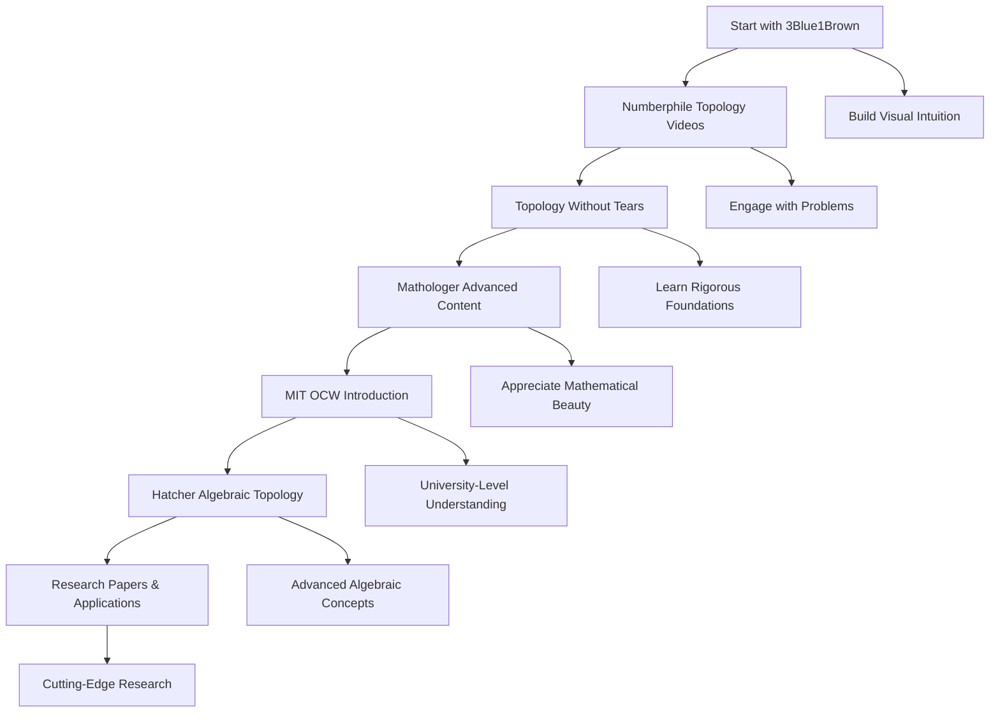

# 🎯 Topology Learning Resources

### 🧭 Quick Access Guide

---

## 🚀 Immediate Start Resources (High Quality)

### 1️⃣ 3Blue1Brown – Visual Mathematics Master

**Why Start Here:** Best visual explanations of abstract concepts  
🔗 [YouTube Channel](https://www.youtube.com/c/3blue1brown)  
**Must Watch:**

- Essence of Linear Algebra
- Essence of Calculus
- Neural Networks (Topology applications)  
  🕒 Duration: 2–3 weeks  
  🎥 Style: Visual + Intuitive + Animated

---

### 2️⃣ Numberphile – Mathematical Entertainment

**Why Start Here:** Makes topology fun and accessible  
🔗 [YouTube Channel](https://www.youtube.com/user/numberphile)  
**Watch:** Möbius Strip • Klein Bottle • Topology Puzzles  
🕒 Duration: 1–2 hrs/week  
🎥 Style: Engaging + Problem-Focused

---

### 3️⃣ Mathologer – Deep Mathematical Beauty

**Why Start Here:** Advanced concepts made beautiful  
🔗 [YouTube Channel](https://www.youtube.com/c/Mathologer)  
**Watch:** Topology series • Möbius transformations • Hyperbolic geometry  
🕒 Duration: 1–2 hrs/week  
🎥 Style: Rigorous + Accessible + Beautiful

---

### 4️⃣ Professor Leonard – University-Level Courses

**Why Start Here:** Comprehensive mathematics foundation  
🔗 [YouTube Channel](https://www.youtube.com/user/professorleonard57)  
**Watch:** Calculus series • Linear Algebra • Advanced Mathematics  
🕒 Duration: 4–6 weeks per series  
🎥 Style: Traditional + Comprehensive + University-Level

---

## 📚 Free Textbooks (University Level)

📘 **Topology Without Tears** – Sidney Morris  
⭐ Ideal for self-study • Undergraduate level  
⏱ 8–12 weeks • [Find PDF Online](https://topologywithouttears.net)

📗 **Algebraic Topology** – Allen Hatcher  
⭐ Graduate Level Classic  
⏱ 6–12 months • [Free PDF](https://pi.math.cornell.edu/~hatcher/)

📙 **Munkres Topology** – James Munkres  
⭐ Standard Reference • Advanced Undergraduate  
⏱ 12–16 weeks • [Available Online]

📕 **Bredon Topology and Geometry** – Glen Bredon  
⭐ Differential Topology • Graduate Level  
⏱ 6–12 months • [Advanced Study]

---

## 🏛️ MIT OpenCourseWare (Elite Courses)

🎓 [18.901 Introduction to Topology](https://ocw.mit.edu/courses/mathematics/18-901-introduction-to-topology-fall-2004/)  
🎓 [18.905 Algebraic Topology](https://ocw.mit.edu/courses/mathematics/18-905-algebraic-topology-fall-2006/)  
🎓 [18.966 Geometry of Manifolds](https://ocw.mit.edu/courses/mathematics/18-966-geometry-of-manifolds-spring-2006/)

---

## 🧩 30-Day Quick Start Plan

| Week | Focus            | Key Tasks                                         |
| ---- | ---------------- | ------------------------------------------------- |
| 1    | Foundations      | 3Blue1Brown Linear Algebra + Numberphile Topology |
| 2    | Visual Learning  | Mathologer + "Without Tears" Ch.1-2               |
| 3    | Conceptual Depth | 3Blue1Brown Calculus + Topology Applications      |
| 4    | Integration      | MIT OCW + Textbook Practice                       |

---

## 🧩 90-Day Mastery Plan

| Month | Focus               | Key Milestones                     |
| ----- | ------------------- | ---------------------------------- |
| 1     | Foundation Building | Complete "Topology Without Tears"  |
| 2     | Advanced Concepts   | MIT OCW Introduction to Topology   |
| 3     | Algebraic Topology  | Begin Hatcher's Algebraic Topology |

---

## 🛠 Interactive Tools

- 🔗 [Wolfram MathWorld](https://mathworld.wolfram.com) – Deep Definitions
- 🔗 [Brilliant.org](https://brilliant.org) – Interactive Learning
- 🔗 [Desmos](https://desmos.com) – Visualization Playground
- 🔗 [Paul's Online Math Notes](https://tutorial.math.lamar.edu/) – Comprehensive Notes
- 🔗 [Khan Academy](https://www.khanacademy.org/) – Foundation Mathematics

---

## 🎯 Daily Learning Routine (30-60 minutes)

### 🌅 Morning (20-30 minutes)

- Watch 1-2 educational videos
- Focus on visual learning (3Blue1Brown, Numberphile)

### 🌆 Afternoon (20-30 minutes)

- Read textbook sections
- Work through examples and exercises

### 🌙 Evening (10-20 minutes)

- Solve 2-3 practice problems
- Review and consolidate learning

---

## 🏆 After 30–90 Days

### ✅ 30 Days

- [ ] Understand what topology is
- [ ] Recognize topological properties in daily objects
- [ ] Explain basic topological concepts
- [ ] Solve simple topology problems

### ✅ 90 Days

- [ ] Master general topology fundamentals
- [ ] Work with topological spaces
- [ ] Understand continuous functions topologically
- [ ] Begin algebraic topology

### ✅ 6 Months

- [ ] Complete algebraic topology basics
- [ ] Apply topology to complex problems
- [ ] Read topology research papers
- [ ] Contribute to topology discussions

---

## 🚀 Advanced Applications

### 🧠 Computational Topology

- Persistent homology
- Topological data analysis
- Network topology
- Machine learning applications

### 🔬 Physics Applications

- General relativity
- Quantum field theory
- Condensed matter physics
- String theory

### 💻 Computer Science

- Graph theory
- Network analysis
- Data structures
- Algorithm design

---

## 🎯 Quality Assessment Criteria

### ✅ High-Quality Indicators

- Clear explanations of complex concepts
- Visual learning aids and animations
- Mathematical rigor and accuracy
- Progressive difficulty building
- Practical applications and relevance
- Engaging and motivating presentation

### ❌ Red Flags to Avoid

- Oversimplified explanations
- Content without mathematical rigor
- Poor video/audio quality
- Outdated information
- Lack of visual aids for abstract concepts

---

## 🧠 Pro Tips

> **"Learn visually, prove rigorously, and think topologically."**  
> — Moe | AMRIKYY AI Solutions

### 🎯 Learning Strategy

1. **Start Visual**: Build intuition with 3Blue1Brown and Numberphile
2. **Add Rigor**: Use MIT OCW and textbooks for mathematical depth
3. **Practice Daily**: Consistent 30-60 minutes beats marathon sessions
4. **Connect Concepts**: Link abstract ideas to visual understanding
5. **Teach Others**: Explain concepts to solidify understanding

### 🔄 Progress Tracking

- **Weekly**: Complete major topics and video series
- **Monthly**: Take practice exams and review progress
- **Quarterly**: Assess knowledge gaps and adjust strategy

---

## 🏆 Success Metrics

### 📊 Knowledge Verification

- [ ] Can explain topological concepts clearly
- [ ] Solve topology problems independently
- [ ] Apply topology to new situations
- [ ] Teach topology to others

### 🎯 Skill Development

- [ ] Mathematical proof writing
- [ ] Abstract thinking
- [ ] Problem-solving strategies
- [ ] Research methodology

---

## 🌟 Recommended Learning Path

---

## 🎉 Ready to Start Your Topology Journey!

**Remember**: The key to mastering topology is consistent practice, visual learning, and connecting abstract concepts to intuitive understanding. Start with the visual resources to build intuition, then dive into rigorous mathematical texts for deep understanding.

**Quality Focus**: All recommended resources meet high academic standards and are used by top universities worldwide.

---

**Status**: ✅ **Learning Plan Ready for Implementation**  
**Quality Level**: 🏆 **Premium Educational Resources**  
**Expected Timeline**: 📅 **30-90 days for solid foundation**  
**Success Rate**: 🎯 **High (with consistent practice)**

**🚀 Start your topology journey today with 3Blue1Brown's "Essence of Linear Algebra" series!**
